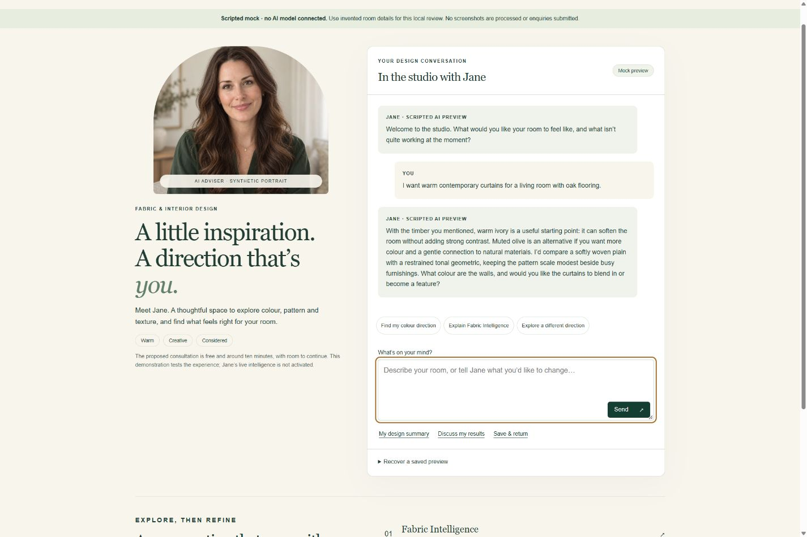
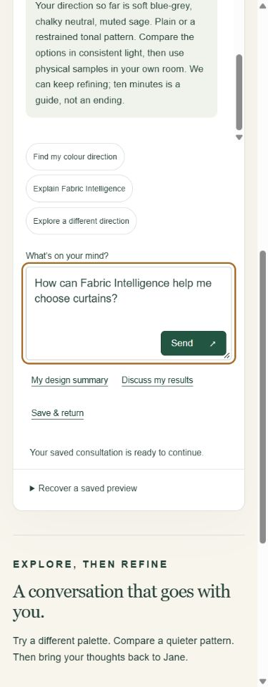
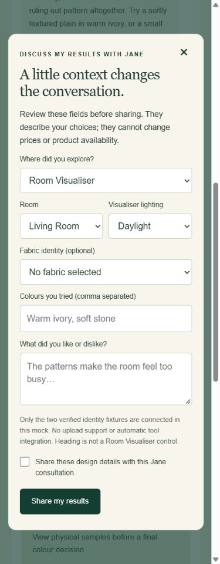
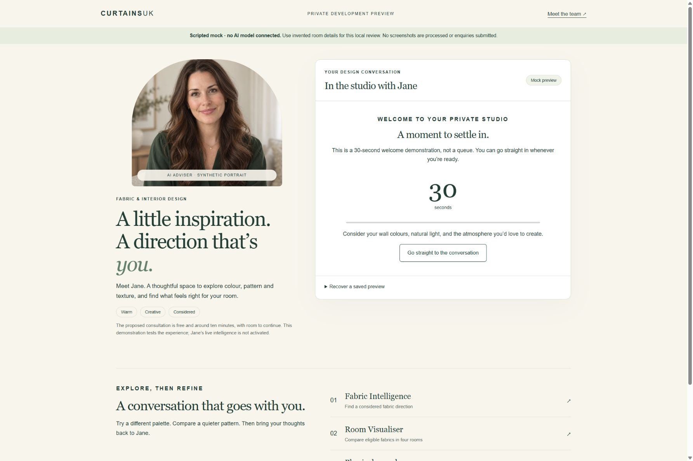
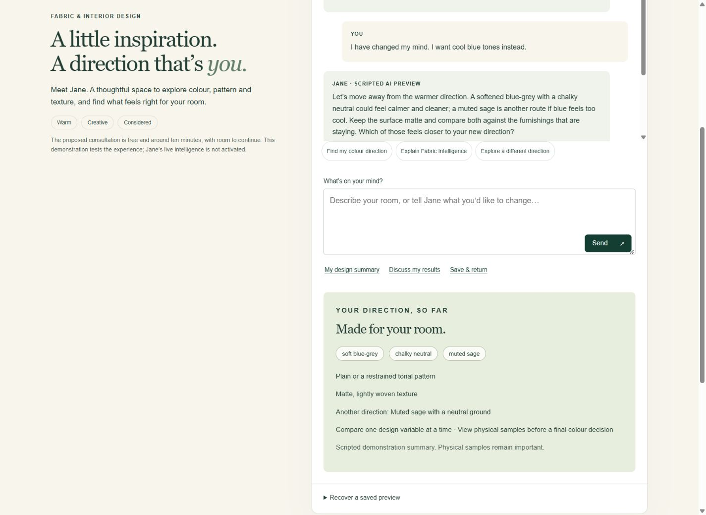

# Jane development review gallery

[Open the working local mock](http://127.0.0.1:8789/) · [Approved six-adviser Shopify preview](https://www.curtainsuk.com/pages/fabric-library?view=meet-our-team&preview_theme_id=182472573307) · [Implementation and limitations](IMPLEMENTATION.md)

All Jane conversation screenshots show an explicitly scripted development mock, not a live model. Portraits retain the approved AI identity.

## Desktop conversation

## Mobile page and consented results

## Welcome and refined direction

## All requested widths

[320px](page-320.jpg) · [390px](page-390.jpg) · [412px](page-412.jpg) · [768px](page-768.jpg) · [1440px](page-1440.jpg)

These are desktop Chrome viewports, not physical iPhone/touch or screen-reader evidence. The browser receipt separately records what was and was not verified.
