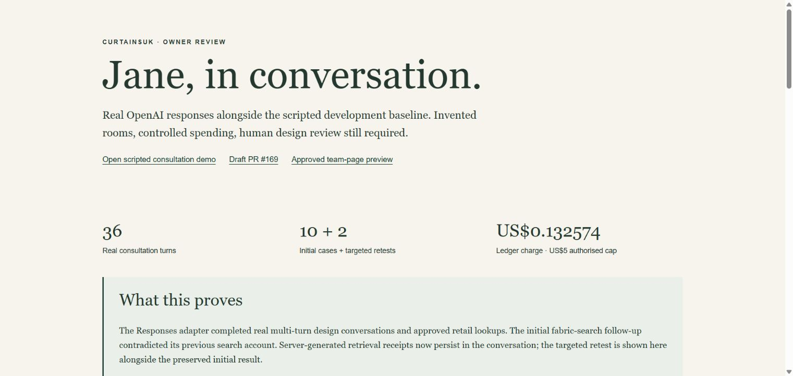
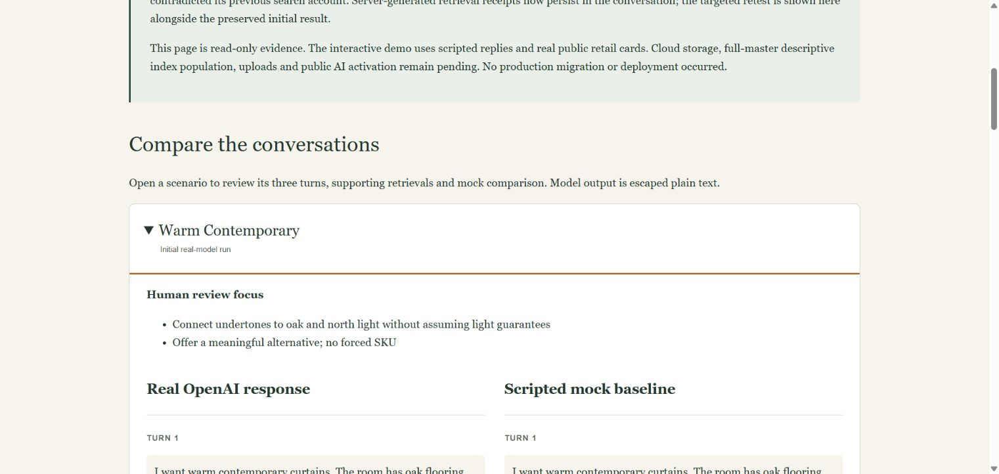
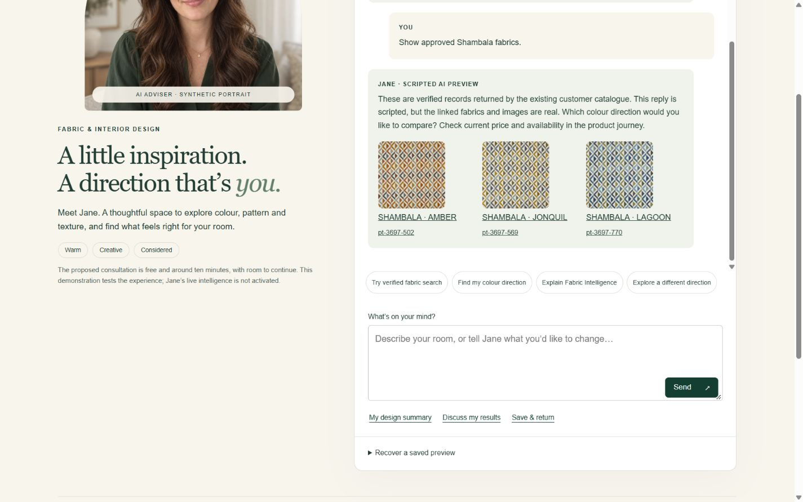

# Jane readiness — implementation and owner review

9 October 2026. Draft [PR #169](https://github.com/Nylon1/CurtainsUK/pull/169), branch `feat/jane-consultation-phase2-20261009`. Starting Jane commit `90722cd22a1485611f5464c03e7c98e51a2a39a7`; protected HEAD `3649c879a4a5ddf88c2093a4172d20fbc58cd265`. PR #167 remains unchanged at `851078c674ac2e9231e51dffbd5949ed4ea7c6d1`, with both required gates successful. It remains an independent unpublished team-page candidate.

## Review now

- [Actual OpenAI conversations vs scripted baseline](http://127.0.0.1:8789/evaluation), or [offline HTML gallery](review-gallery.html).
- [Working scripted Jane preview](http://127.0.0.1:8789/) with verified public retail cards. Run `node scripts/jane-preview.mjs` if the local server is stopped.
- [Approved six-adviser Shopify preview](https://www.curtainsuk.com/pages/fabric-library?view=meet-our-team&preview_theme_id=182472573307).
- [Detailed architecture, contracts, security, costs and release recommendation](../../docs/specialist-advisory/JANE_READINESS.md).
- [Programme source of truth](../../docs/CURTAINSUK_SPECIALIST_AI_ADVISORY_PLATFORM.md).
- [Exact changed files for this readiness increment](changed-files.txt); [complete Jane PR scope relative to PR #167](pr-changed-files.txt).

The gallery is read-only real-model evidence. The interactive chat remains labelled scripted mock. No production AI activation, migration, deployment or publication occurred.

## Outcome

Jane's catalogue HTTP 400 was traced to an omitted `browseGuide=1` parameter. The existing prepared RPC expects five arguments; the published browsing path already sends them. Only Jane's adapter was corrected. The same real Shambala query returns four source records, three of which meet Jane's commercial/image/profile gates. [Catalogue verification](catalogue-verified.json).

Implemented cloud-ready persistence, verified-principal contract, account-bound one-use recovery, deletion, database leases with stale-worker fencing, revision protection, shared rate limits and durable per-run/per-consultation spending caps. These run successfully in local PostgreSQL tests; no hosted schema was created. Added bounded incremental GIN knowledge search and a private read-only RPC, rehydrating facts from the original safe projection. Production full-master descriptive coverage still awaits approved index population and credentialed end-to-end verification.

The owner-authorised real OpenAI evaluation completed ten three-turn scenarios, followed by two targeted three-turn retests. **36 real turns, 53 model responses, zero service errors.** A false search-history retraction in the initial run was corrected by persisting server-generated retrieval receipts in subsequent conversation context. The retest verifies that Jane accurately recalls a failed descriptive search and completed empty retail search, then returns the three approved Shambala cards. Earlier transcripts remain preserved. Human interior-design scores and approval are pending.

**Spend:** US$0.132543 estimated from reported token usage; US$0.132574 charged by the conservative local ledger, within US$5 total/US$1 per consultation. This is application accounting, not an independently reconciled invoice. The supplied key was transient process-only and is absent from Git/evidence. No further paid runs are scheduled.

## Tests and evidence

| Evidence | Result |
| --- | --- |
| [Consultation/evaluation tests](consultation-final.log) | 24 pass, including persisted retrieval receipts and graceful reference failures |
| [Cloud security/runtime](cloud-final.log) | 5 pass; local PostgreSQL execution, two workers, isolation, recovery, deletion, revocation checks, leases, caps |
| [Knowledge index/RPC](knowledge-final.log) | 1 pass; all requested dimensions, safe fields, incremental hashing, GIN plan, partial coverage |
| [Ownership RLS](storage-rls-final.log) | 1 pass |
| [Existing Phase 1](phase1-final.log) | 20 pass |
| [Existing theme regression](regression.log) | 18 pass |
| [Scoped ESLint](lint-final.log) | Exit 0; empty output indicates no diagnostics |
| [Browser widths/images/welcome](browser.json) | 320/390/412/768/1440 CSS px; no overflow, all three approved images loaded; automatic welcome transition |
| [Real model initial run](openai-evaluation.json) | 10 cases, 30 turns, 40 responses; human review pending |
| [Real model targeted retest](openai-retest-evaluation.json) | 2 cases, 6 turns, 13 responses; search continuity correction demonstrated |
| [Mock comparison](mock-evaluation.json) | 10 cases, 30 turns, no model calls |

The initial combined test attempt [tests.log](tests.log) exhausted available memory. It is retained as failed evidence, not counted as a pass. Serial PostgreSQL runs with `--liftoff-only --wasm-num-compilation-tasks=1` passed. No dependencies were installed. No intensive full build or bulk supplier ingestion was run.

The real-model rubric covers room understanding, plausible design reasoning, alternatives, feedback adaptation, natural concise voice, tool accuracy, evidence/eligibility and personalised next steps. Formal review should use blind-labelled copies before revealing provider. A known polish item is customer-friendly wording in place of internal Fabric Intelligence feedback tokens; the gallery retains the actual evaluated wording.

Physical iPhone Safari, actual screen-reader behaviour, enabled browser/OS reduced motion and confirmed hidden-tab timer behaviour remain pending. Observed document visibility did not become hidden, so that attempted check is not represented as success. Unit-tested timer restoration and Chrome viewport checks do not replace those checks. Existing product systems were not changed to satisfy tests.

Final keyboard checks expanded the review-gallery disclosure with Enter and moved between fabric links with Tab; both had visible solid focus. Product accessible names contain design, colour and exact identity. Two transient catalogue failures during the final UI check preserved the draft and showed an error. A later fresh request returned HTTP 200 in 2.445 seconds and rendered all three verified cards/images. Status/timing-only preview diagnostics were added; they do not log query text, customer messages or credentials. See [completion state](completion-state.json).

## Screenshot gallery

| Desktop | Mobile |
| --- | --- |
|  |  |

Other widths: [320](jane-320.jpg), [412](jane-412.jpg), [768](jane-768.jpg).

## Release and storage

**Hold Jane public activation.** The next step is owner review of these real conversations and a separately approved protected cloud trial: hosted Auth/RPC, multi-worker behaviour, incremental full-master index coverage, privacy/retention operations and outstanding accessibility checks. Upload processing remains unavailable. PR #167 can proceed independently through its existing scoped release procedure after separate owner authorisation; do not publish the entire development theme.

PR #169 still targets a feature branch and therefore does not run the protected production workflow. Exact-head owner policy approval for protected test paths and both required checks remain mandatory when this stack is retargeted. No gate or policy was modified.

Final measured C: free space: **36.44 GiB** (start 37.03 GiB). Restic PID **45016** remains present. No cleanup, historical worktree deletion, backup script, manifest or backup repository change occurred. A process observation does not prove snapshot success or coverage. New work requires a subsequent verified backup.

Naila, Fabric Intelligence decisions, Room Visualiser 2, Shopify theme/live navigation, House of Curtains, pricing, stock, checkout, payments and manufacturing remain unchanged. Production reads were bounded and read-only. No customer enquiries or notifications were sent.
