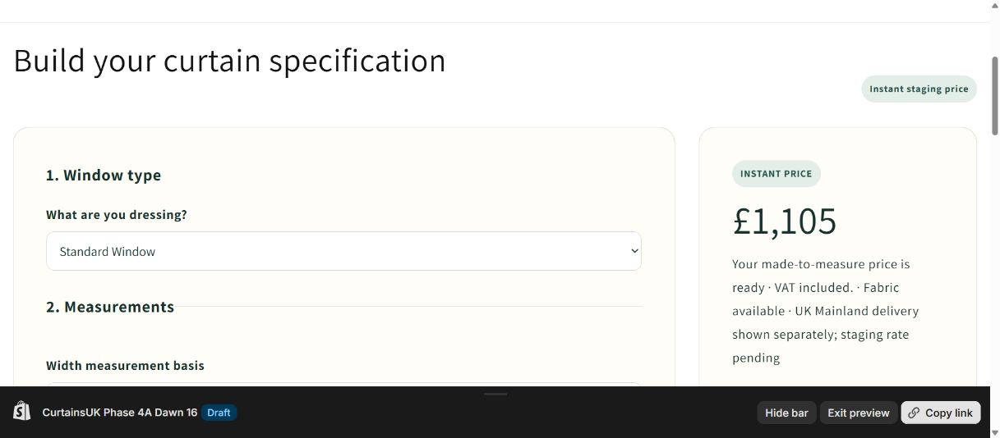
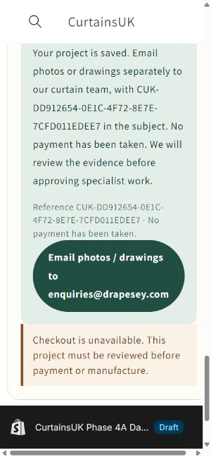
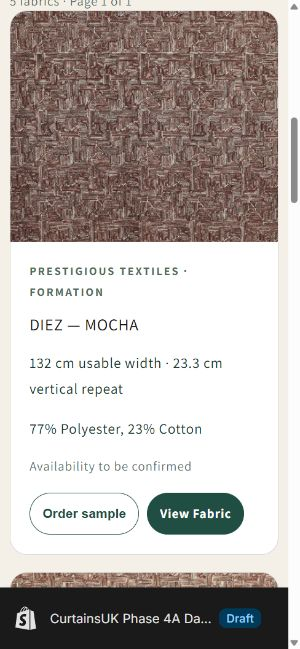

# Phase 5L — Commerce activation

Branch: `feature/curtainsuk-phase-5a-prelaunch`.

**A real Sanderson curtain now passes price and quantity-specific stock verification in unpublished Dawn. Test Draft Order creation remains blocked by unconfirmed shipping.**

Pilot: Sanderson **Painters Garden — Violet/Crimson**, canonical fabric `sdg-dapgpa203`, standard window, 200 cm track width × 220 cm drop, pencil pleat, standard lining, pair. The engine calculates **4 fabric widths, 2.64 m repeat-adjusted cuts, 10.6 m ordered fabric, £1,105 VAT-inclusive goods** (£920.83 net + £184.17 VAT). The authenticated exact-SKU portal quote matches the previously approved net cut-price basis. A current single piece exceeds the requirement. The observation is appended and approved through existing supplier governance; source prices, batch/piece references and quantities stay private. No supplier order or reservation was made.

The approved stock evidence expires **2026-09-09 14:34:25 UTC**. `ORDER_READY` is conditional on the actual configuration and current evidence, not a blanket catalogue flag. Shipping and customer/review approval remain separate checkout gates.

## Status

| Area | Status | Evidence / remaining limit |
|---|---|---|
| Catalogue | PASS | 6,328 browsable, image-ready and description-ready retained; 925 known discontinued hidden; 2,685 non-discontinued records unresolved. No catalogue activation or image associations changed. |
| Price-ready | PASS | 251 existing approved price bases: 250 Prestigious + 1 Sanderson. All 250 selected/current PT bases pass the expiry/approval lookup. A price basis does not guarantee complete manufacturing specifications. |
| Order-ready | PASS | One real Sanderson pilot configuration passes current price + sufficient single-piece stock. Zero checkout-ready orders while shipping is unset. Catalogue responses still advertise no blanket order readiness. |
| Just-in-time price verification | PASS | Browsable unpriced/spec-incomplete fabrics can be configured and submitted into the existing governed staff workflow, with null customer price and a signed canonical configuration. Supplier lookup/confirmation is staff-operated; no new supplier automation. |
| Stock verification | BLOCKED | Sanderson pilot passes. Fresh PT single-batch checks cannot be completed while Webtex is at its login screen. No bulk stock checking. |
| Shipping | OWNER DECISION REQUIRED | All nine rates, postcode mapping and parcel/packing thresholds remain unset. Exact input table below. |
| Samples | PASS | Sanderson sample intent retained canonical fabric and Bay context; Resume my curtains restored both. Existing saved samples remained. Unknown sample availability still requires confirmation; no sample checkout. |
| Instant Price | PASS | Deployed Dawn shows £1,105 including VAT and Fabric available for the verified pilot. Preparing checkout reports SHIPPING_NOT_READY. |
| Price With Review | PASS | Bay submission, staff revision and approval exercised against staging DB; original submission immutable, readiness blocked on current stock/shipping. |
| Manual Quote | PASS | No numeric customer price before staff quote; synthetic quote/revision/approval tested. Real unpriced SDG selection saved for confirmation from mobile. |
| Specialist review | PASS | Apex/Gable email evidence states, revision reset, review/approval, actor audit and no-upload enforcement pass. Synthetic evidence receipt and quote amounts are training actions, not real supplier/production approval. |
| Draft Order | BLOCKED | Development store explicitly permits only test payments. Current app credentials authenticate and required Draft Order permission is present. No approved shipping charge exists; mode remains DISABLED and zero remote Draft Orders were created. |
| Price immutability | BLOCKED | All 324 engine cases preserve the existing result when a higher supplier cost is simulated and use the new cost only for a new calculation. Persisted staff originals remain immutable. Remote Draft Order immutability cannot be rehearsed before an approved shipping charge permits the first Draft Order. No simulated supplier price was written as real commercial evidence. |
| Desktop/mobile QA | PASS | Desktop real-price/configuration/checkout gate; mobile unpriced review submission, samples, filters and window handoff verified. 24-record pagination retained. Fixed a reproduced Bay→library context-loss bug. |
| Catalogue security/privacy | PASS | Sampled public pages, filters and detail contain no supplier-commercial or credential fields; approved Shopify CDN images and staging noindex retained. Restricted reviewer/anonymous/customer access checks pass. |
| Bonded interlining | OWNER DECISION REQUIRED | Separate interlining is not a confirmed bonded product basis. Bonded price remains unavailable; no substitute cost invented. |
| Review mailbox | OWNER DECISION REQUIRED | Current Dawn `shop.email` resolves to enquiries@drapesey.com. Confirm whether to use enquiries@curtainsuk.com or retain the configured mailbox. No store-wide email change or test email was sent. |

## Owner shipping input table

Enter gross customer delivery charges including VAT; blank means **blocked**, not free.

| Delivery region | Standard | Large | Oversize |
|---|---|---|---|
| UK Mainland | Required | Required | Required |
| Highlands / Islands | Required | Required | Required |
| Northern Ireland | Required | Required | Required |

For each parcel class supply maximum length/width/height in mm and weight in grams, plus carrier/service and effective date. Supply the overall maximum parcel dimensions/weight, explicit postcode mapping/exclusions, and the conservative packing rules that map curtain quantities/drop to parcel class. Specialist/manual overrides require a staff-approved exact gross quote bound to the configuration/revision and carrier service. A one-configuration pilot quote must still pass the existing governed shipping mechanism; no arbitrary shipping amount is accepted from the browser.

Edit `config/curtainsuk-shipping-owner-inputs.json` and approve the corresponding staging rate versions through the existing shipping admin workflow. Merely editing JSON does not create an approved database rate. For bonded interlining also confirm the supplier product, net cost/metre, usable width, and whether it replaces or supplements the selected lining.

## Validation and performance

324/324 real-PT matrix cases pass: six designs, three headings, three linings, pair/single, three widths/drops. Independent checks cover pair centre overlap, balanced widths, repeat allowance, metres, £25/width make-up, heading factors, component costs, 35% target gross margin, VAT and nearest-£1 gross rounding. These are the existing staging rules `2.2.0-draft.1`; this phase does not activate production pricing rules.

TypeScript passes. Decision-engine 24, storefront 107, supplier-intelligence 11 and fabric-master 47 tests pass (189 total). Final theme-only rerun: 18/18. Staging DB/API rehearsals separately exercise authentication, staff permissions, immutable submissions, stale revision rejection, evidence-state transitions and checkout blockers.

Public Shopify-proxy observations after deployment: initial catalogue 2.186 s; page 2 1.665 s; final page 1.540 s; search 2.185 s; brand/collection/colour/pattern filters 1.199–1.514 s; detail 0.967 s. Largest sampled payload 58,479 bytes; 24 cards maximum, 16 on the final page. These are individual end-to-end network observations, not load-test percentiles or a controlled latency comparison. No demonstrated frontend/payload bottleneck justified new architecture.

Mobile viewport override was 390×844; browser zoom yielded 312 CSS px, with document width 300 px and no horizontal overflow. Mobile filter combination Prestigious + Formation + brown returned five matching records. Bay→Browse all fabrics→View Fabric retained `window=bay-window` after the fix. Desktop pagination moved from page 1 to page 2; API checks cover the final page and filter routes. Individual cards retain native lazy loading. Long-duration soak/load testing and completed payment journeys are not claimed.

## Deployment and evidence

Preview deployment: `curtainsuk-staging-pk6p7cqrb-hamzas-projects-4ef62f35.vercel.app`, assigned only to the existing `curtainsuk-staging-gateway.vercel.app` alias. Unpublished Dawn **182264234363** received the configurator JS and section changes. Minimal **79650455661** remains live and was not modified. No real payment settings, Merchant Center or supplier-order automation changed.

- `pricing-matrix.json`: all real calculation cases and local cost-change simulations.
- `sdg-pilot-verification.json`: safe verification summary and commercial snapshot version.
- `email-evidence-rehearsal.json`: staff cases (before fresh Sanderson stock update).
- `just-in-time-rehearsal.json`: persisted unpriced-fabric confirmation path.
- `development-store-safety.json`: verified test-only store and granted Draft Order scope.
- `public-performance.json`: public pagination/filter/detail latency and privacy checks.
- `browser-qa.json`: observed desktop/mobile journeys and receipt.
- `secret-scan.json`: pre-commit scan of tracked/proposed text files.

The 195 genuine identity-conflict candidates remain withheld in the existing exception queue. Zoffany source recovery and the remaining 2,685 records are secondary work; neither is a commerce launch gate and neither was remapped in this phase.
